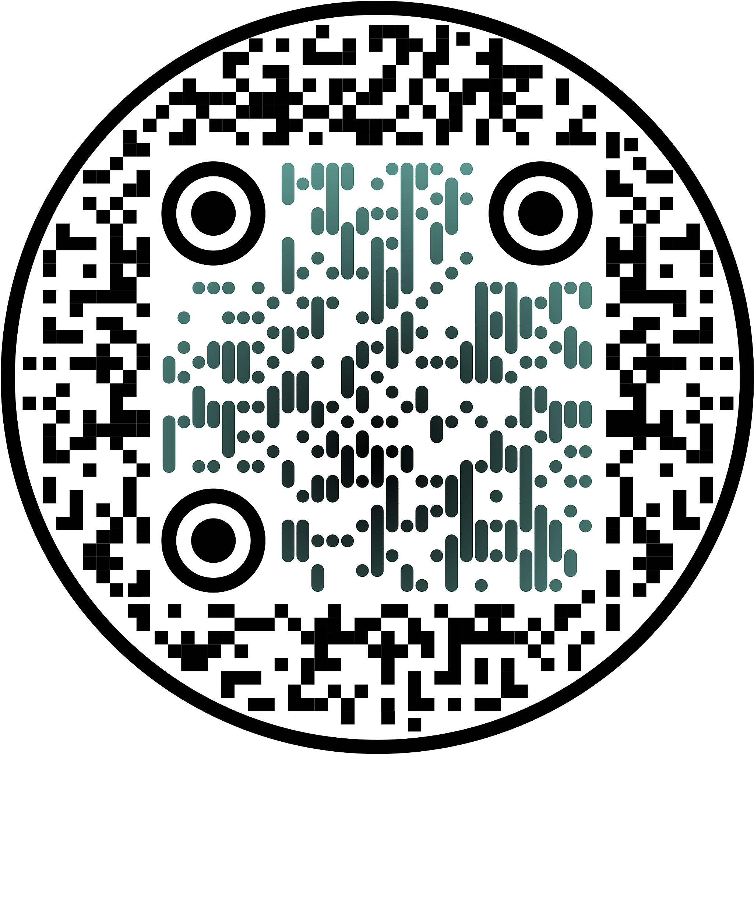

<div align="center">


<h1>SADAR</h1>

<p><b>Smart Anomaly Detection for Aviation Routes</b></p>

<p>Detección temprana de comportamiento de vuelo no conforme sobre Madrid-Barajas (LEMD).</p>

<p>
  
</p>

<p>
  <a href="README.md"></a>
  ·
  <a href="README.es.md"></a>
</p>

<p>
  
  
  
  
  
  
  
  
  
  
</p>

</div>

---

### Descripción del proyecto

**SADAR** (Smart Anomaly Detection for Aviation Routes) es un sistema de deep learning que aprende cómo es una aproximación o despegue **normal** en Madrid-Barajas (LEMD) y marca cualquier trayectoria que se desvíe del patrón aprendido: motores y al aire (go-arounds), rutas anómalas, pérdidas de transpondedor o maniobras compatibles con una emergencia.

Está construido sobre tres autoencoders profundos entrenados con unos 20.000 vuelos reales de ADS-B de la red OpenSky: un **autoencoder LSTM**, un **autoencoder Transformer** y un **VAE-LSTM**. Los tres se entrenan en igualdad de condiciones y se comparan cabeza a cabeza; el **VAE-LSTM** es el que se sirve en producción porque combina la mejor PR-AUC con la menor latencia de detección.

> **Alcance.** SADAR se entrena exclusivamente con operaciones normales de LEMD y funciona como monitor de conformidad de trayectorias: aprende el patrón normal y señala cualquier desviación para revisión humana. No es un predictor de eventos catastróficos.

### Lo destacado

- **Deep learning de una sola clase** sobre 7 variables dinámicas (posición, altitud, velocidad, seno/coseno del rumbo, régimen vertical).
- **Selección comparativa**: baseline Isolation Forest vs LSTM vs Transformer vs VAE-LSTM con el mismo preprocesado y las mismas métricas.
- **Banco de anomalías sintéticas** con cinco tipos de inyección (desviación de ruta, salto de altitud, anomalía de velocidad, holding, congelado de transpondedor) en varias intensidades, mide **PR-AUC** y **latencia de detección**.
- **Dashboard estilo torre de control** con React + Vite: radar en vivo, ranking de anomalías, simulador con sliders y página de métricas.
- **Totalmente reproducible**: `uv` para Python, `pnpm` para el front, configs YAML, semillas fijas.

### Stack

| Capa | Herramientas |
|---|---|
| Modelos | PyTorch · scikit-learn (baseline) · Optuna · MLflow |
| Datos | pandas · pyarrow · pyproj · NumPy |
| Backend | FastAPI · uvicorn · uv |
| Frontend | React 18 · Vite 5 · TypeScript · framer-motion |
| Despliegue | Docker · Hugging Face Spaces |

### Capturas de la demo

<details>
<summary><b>1. Consola torre - radar en directo sobre LEMD</b></summary>


Scope en tiempo real centrado en Barajas. Cada aeronave se colorea según su estado (en seguimiento / en alerta) y el panel lateral muestra todos los vuelos del espacio aéreo con su indicativo y su estado.

</details>

<details>
<summary><b>2. Simulador - inyecta una anomalía y observa la alerta</b></summary>


La estrella de la demo. Eliges un vuelo normal, seleccionas el tipo de anomalía (desviación de ruta, salto de altitud, velocidad, holding, corte de transpondedor), ajustas intensidad y momento, y la inyectas en vivo. El score de la derecha cruza el umbral y se reporta la latencia en segundos.

</details>

<details>
<summary><b>3. Métricas - comparación de modelos y detector elegido</b></summary>


Reporta la PR-AUC y el desempeño por anomalía de baseline, LSTM, Transformer y VAE-LSTM, además del motivo por el que se selecciona el **VAE-LSTM** como modelo de producción.

</details>

<details>
<summary><b>4. Métricas - desglose por tipo de anomalía</b></summary>


PR-AUC detallada por tipo de anomalía e intensidad. Sirve para justificar qué detector funciona mejor en cada modo de fallo.

</details>

<details>
<summary><b>5. Consola torre - instantánea completa del tráfico de LEMD</b></summary>


Vista más amplia del radar con toda la flota visible, bloque de datos del vuelo y, abajo a la derecha, el histograma en vivo del anomaly score.

</details>

<details>
<summary><b>6. Consola torre - alerta levantada sobre un vuelo</b></summary>


Una aeronave marcada se pone en rojo y el controlador recibe el score, el umbral y la clasificación sugerida en el panel derecho.

</details>

### Arquitectura

```
        ┌──────────────────┐         ┌──────────────────┐
        │  Parquet ADS-B   │         │  Banco anomalías │
        │  (OpenSky / LEMD)│         │  sintéticas      │
        └────────┬─────────┘         └────────┬─────────┘
                 │                            │
        ┌────────▼────────┐                   │
        │ Preprocesado    │                   │
        │ · limpieza      │                   │
        │ · resample 10s  │                   │
        │ · XY relativos  │                   │
        │ · sin/cos rumbo │                   │
        │ · estandarizado │                   │
        └────────┬────────┘                   │
                 │                            │
        ┌────────▼────────────────────────────▼────────┐
        │   Entrenamiento (solo vuelos normales)       │
        │  ┌──────────┐ ┌─────────────┐ ┌────────────┐ │
        │  │ Isolation│ │ LSTM-AE     │ │ Transformer│ │
        │  │ Forest   │ │             │ │ AE         │ │
        │  └──────────┘ └─────────────┘ └────────────┘ │
        │            ┌─────────────────┐               │
        │            │  VAE-LSTM ★     │  ← elegido    │
        │            └─────────────────┘               │
        └────────┬─────────────────────────────────────┘
                 │  checkpoint + scaler + umbral
        ┌────────▼─────────┐
        │  Servicio FastAPI│  /api/health · /api/scene
        │  (uvicorn)       │  /api/flights · /api/metrics
        └────────┬─────────┘  /api/simulate
                 │
        ┌────────▼─────────┐
        │  React + Vite    │  Radar · Simulador · Métricas
        │  dashboard       │
        └──────────────────┘
```

### Ejecutarlo en local

Requisitos: **Python 3.11**, [`uv`](https://docs.astral.sh/uv/) para las deps de Python, **Node 20+** y [`pnpm`](https://pnpm.io/) para el frontend.

Dashboard en `http://localhost:5180`, API en `http://localhost:8000`.

<details>
<summary><b>macOS / Linux - con Makefile (recomendado)</b></summary>

```bash
uv sync
pnpm -C frontend install
make dev
```

`make dev` arranca el backend FastAPI y el frontend Vite juntos con hot reload.

</details>

<details>
<summary><b>macOS / Linux - sin Makefile</b></summary>

Dos terminales:

```bash
# terminal 1: backend
uv sync
uv run uvicorn sadar.serve.app:app --port 8000

# terminal 2: frontend
pnpm -C frontend install
pnpm -C frontend dev
```

</details>

<details>
<summary><b>Windows (PowerShell)</b></summary>

PowerShell no trae `make`; arranca los dos servicios en dos terminales.

```powershell
# instalación una sola vez
uv sync
pnpm -C frontend install

# terminal 1: backend
uv run uvicorn sadar.serve.app:app --port 8000

# terminal 2: frontend
pnpm -C frontend dev
```

Si no tienes `pnpm`: `npm install -g pnpm`. Si no tienes `uv`: `winget install astral-sh.uv`.

</details>

<details>
<summary><b>Windows con Make (Chocolatey / scoop / WSL)</b></summary>

```powershell
choco install make    # o: scoop install make
make dev
```

O ejecuta todo dentro de WSL Ubuntu y sigue las instrucciones de macOS / Linux.

</details>

### Ejecutarlo con Docker

Igual en cualquier sistema operativo, solo necesitas Docker Desktop / Docker Engine.

<details>
<summary><b>Un contenedor con Docker Compose</b></summary>

```bash
docker compose up --build
```

Abre `http://localhost:5180`. Modelos, tensores preprocesados e informes se montan en sólo lectura desde `./models`, `./data/processed` y `./reports`.

</details>

<details>
<summary><b>Imagen única (la misma que en producción / Hugging Face Spaces)</b></summary>

```bash
docker build -t sadar .
docker run --rm -p 7860:7860 sadar
```

Abre `http://localhost:7860`. Los modelos, tensores e informes van dentro de la imagen; no necesitas volúmenes.

</details>

### Desplegar en Hugging Face Spaces

El repositorio trae un [Dockerfile](Dockerfile) listo para HF Spaces (una sola imagen, el frontend servido por FastAPI en el puerto 7860).

```bash
git lfs install
git clone https://huggingface.co/spaces/<tu-usuario>/sadar
cd sadar
# copia los archivos del repositorio SADAR dentro
git lfs track "*.npy" "*.npz" "*.pt"
git add . && git commit -m "feat: initial deploy" && git push
```

### Estructura del repositorio

```
SADAR/
├── src/sadar/                       Paquete Python (importable como `sadar`)
│   ├── data/                          Pipeline de datos (parquet crudo → tensores)
│   │   ├── pipeline.py                  Punto de entrada: `sadar-preprocess`
│   │   ├── io.py                        Carga de parquet, dedupe, manifests
│   │   ├── cleaning.py                  Nulos, huecos, eliminación de go-arounds
│   │   ├── features.py                  XY relativo a pista, sin/cos del rumbo
│   │   ├── scaling.py                   Estandarización por feature (fit solo en train)
│   │   ├── splitting.py                 Split sin leak por flight_id y fecha
│   │   └── windowing.py                 Ventanas de longitud fija
│   ├── models/                        Modelos y entrenadores
│   │   ├── baseline.py                  Baseline Isolation Forest
│   │   ├── lstm_autoencoder.py          Arquitectura LSTM-AE
│   │   ├── transformer_autoencoder.py   Arquitectura Transformer-AE
│   │   ├── vae_lstm.py                  Arquitectura VAE-LSTM (elegida)
│   │   ├── training.py                  Loop común, device, checkpoint I/O
│   │   ├── train_lstm.py                Entrada: `sadar-train-lstm`
│   │   ├── train_transformer.py         Entrada: `sadar-train-transformer`
│   │   ├── train_vae.py                 Entrada: `sadar-train-vae`
│   │   └── tune_vae.py                  Búsqueda Optuna: `sadar-tune-vae`
│   ├── eval/                          Evaluación y banco sintético
│   │   ├── synthetic.py                 Inyección de anomalías (5 tipos, varias intensidades)
│   │   ├── evaluate.py                  Evaluación por modelo: `sadar-evaluate`
│   │   └── compare.py                   Informe comparativo: `sadar-compare`
│   └── serve/                         Inferencia en producción
│       ├── app.py                       App FastAPI (también sirve la SPA en prod)
│       └── inference.py                 ConformanceService (carga modelo + scaler)
│
├── frontend/                        Dashboard React + Vite (pnpm)
│   ├── src/
│   │   ├── pages/                       Dashboard, Simulador, Métricas, Presentación
│   │   ├── components/                  RadarScope, paneles, gráficas
│   │   ├── api.ts                       Cliente tipado para /api/*
│   │   └── i18n.tsx                     Traducciones EN / ES
│   ├── public/                          Logo y estáticos
│   ├── vite.config.ts                   Proxy de dev /api → :8000
│   └── package.json
│
├── configs/                         Configuración YAML
│   ├── preprocessing.yaml
│   ├── baseline.yaml
│   ├── lstm.yaml · transformer.yaml · vae.yaml
│   ├── tune.yaml · eval.yaml · compare.yaml
│   └── serve.yaml                       Selecciona el checkpoint de producción
│
├── models/                          Checkpoints entrenados (Git LFS)
│   ├── lstm_autoencoder.pt
│   ├── transformer_autoencoder.pt
│   └── vae_lstm.pt                      ★ servido en producción
│
├── data/
│   ├── raw/                           Parquet ADS-B (fuera del repositorio, $SADAR_DATA_DIR)
│   └── processed/                     Tensores estandarizados (Git LFS)
│       ├── scaler.npz
│       ├── train.npy · val.npy · test.npy
│       └── anomalies.npy
│
├── reports/                         Métricas generadas
│   ├── model_comparison.json
│   └── vae_tuning.json
│
├── notebooks/                       EDA
├── docs/assets/                     Capturas y logo del README
│
├── Dockerfile                       Imagen de producción (HF Spaces, un contenedor)
├── docker-compose.yml               Stack local de dos contenedores
├── pyproject.toml · uv.lock         Deps Python gestionadas con uv
├── Makefile                         `make dev`, `make preprocess`, ...
└── README.md · README.es.md         Este archivo (EN / ES)
```

### Limitaciones

- El dataset no contiene incidentes reales catastróficos, SADAR valida una metodología, no eventos históricos.
- No se dispone de planes de vuelo, la "ruta prevista" se aproxima como "patrón normal aprendido".
- Los huecos de transpondedor son mayoritariamente cobertura del receptor, se usan como característica, no como etiqueta.
- Solo hay cuatro vuelos reales con squawk de emergencia, se usan para validar, jamás para entrenar.

---

<div align="center">
  <sub><b>SADAR</b> · Smart Anomaly Detection for Aviation Routes</sub>
  <br />
  <sub>Monitorización de conformidad de vuelos con deep learning sobre Madrid-Barajas (LEMD) · 2026</sub>
</div>
